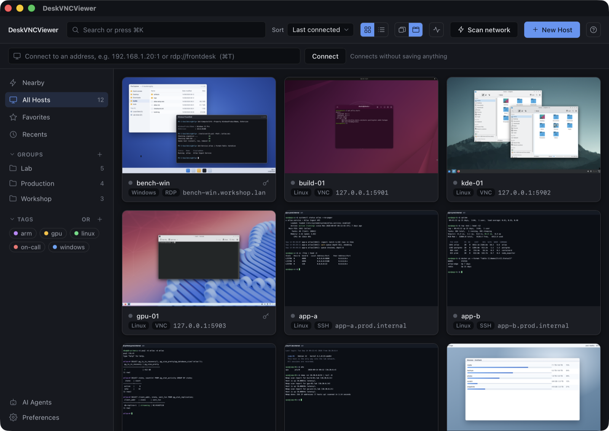
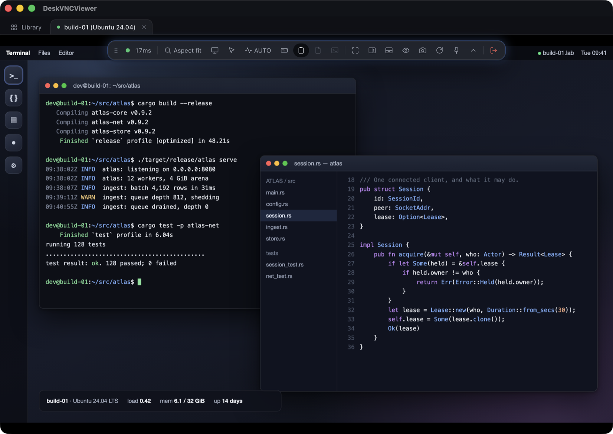
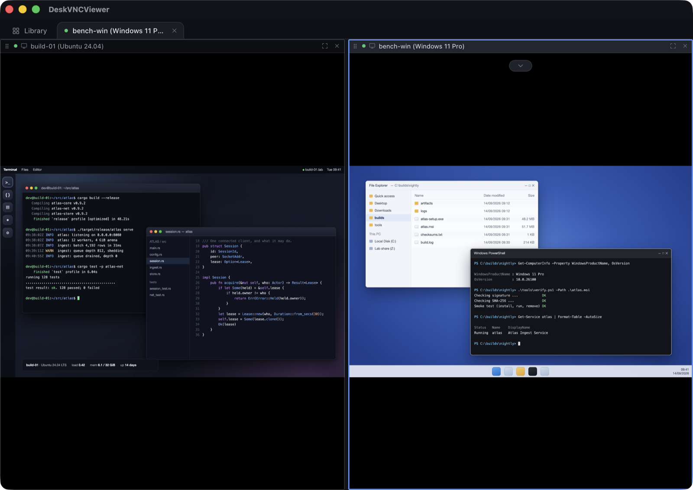
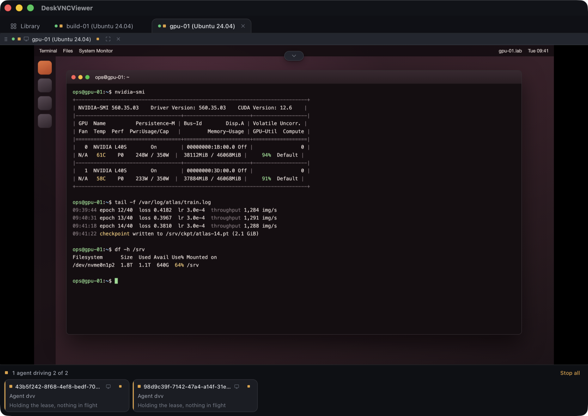

# DeskVNC

One window for every machine you look after, whether it speaks **VNC**, **RDP**
or **SSH**. Native, written in Rust on Tauri 2, and it runs on Windows, macOS
and Linux.

It also has something no other remote desktop client has yet: an optional
control plane that lets an **AI agent drive those same machines**, with nothing
installed on the far end, and a person able to take the wheel back mid task.

[](#license)
[](https://github.com/psmux/DeskVNC/releases/latest)



<sub>Screenshots are a real build against demo servers on loopback, and are for
reference only: the machines in them are invented, and the desktops being viewed
are credited in [docs/images/CREDITS.md](docs/images/CREDITS.md).</sub>

## Why this exists

Anyone who looks after more than a handful of machines ends up with a drawer
full of tools. One client for Windows boxes, another for the Linux server in the
cupboard, a terminal for everything else, and a text file of addresses nobody
trusts. The connection managers that fix this are mostly paid, and several of
them run on a .NET runtime that security teams are busy removing.

DeskVNC puts the three protocols in one library. Your hosts carry their own
credentials and settings, they connect on a double click, and each tile shows
what that machine looked like when you last left it. Passwords go into the
operating system keychain rather than a database next to the profiles. There is
no account, no telemetry, and no paid tier holding a feature back.

## Get started in about a minute

1. Download the build for your machine from the
   [latest release](https://github.com/psmux/DeskVNC/releases/latest).
   macOS is signed and notarized, so it opens normally. On Windows, SmartScreen
   will warn because the installer is not signed yet: choose **More info**, then
   **Run anyway**, or check the published checksum first.
2. Open it and press **New Host**, or paste an address straight into the bar at
   the top and press **Connect**, which saves nothing.
3. Double click a tile. That is the whole flow.

### Need to support someone outside your network?

Download **DeskVNC Support** from the same release page and send it to the
person who needs help. They open it, press **Create invitation**, and approve
your connection. You open **Boundary support** in DeskVNC, paste the invitation,
and connect. Boundary tries a direct encrypted path first and uses its relay
fallback when the networks do not allow a direct path.

For a shorter handoff, configure the shared Boundary code service or your own
private service and share the displayed four digit groups, such as
`1234 5678 9012`. The number expires after one lookup and the person at the
remote computer still approves the session. A full invitation remains available
when no code service is configured.

No account is required for an attended support session. Screen Recording and
Accessibility permissions are requested on macOS when sharing or control needs
them. The recipient can revoke control or end the session at any time.

DeskVNC Support is currently a macOS preview. Windows and Linux support apps,
unattended access, browser access and automatic private provider deployment are
still in development. The release page contains the runnable support app and
the repository's `14-support-codes.md` file documents private code services.

Addresses can be written the way you already think of them: `10.0.0.4`,
`10.0.0.4:5901`, `rdp://frontdesk`, `ssh://ops@jump-01`. If you do not know the
address, press **Scan network** and DeskVNC will find what is listening nearby.

Full install notes, checksum verification and the permissions the app asks for
are in [docs/INSTALL.md](docs/INSTALL.md).

## In a session



The toolbar floats over the desktop and stays out of the way until you reach for
it. From left to right it carries the measured round trip time, scaling, display
and pointer choices, quality, keyboard and clipboard behaviour, file transfer,
a terminal for the same host, fullscreen, pane splitting, view only, a
screenshot button, and the way out.

Things that matter once you actually use it all day:

* The picture is decoded in Rust and painted through WebGL2, so whole frames
  never cross the process boundary. H.264 decodes with hardware acceleration
  where the webview offers it.
* Your scroll wheel and trackpad behave on the remote exactly the way they
  behave on your own machine, whichever direction your system is set to.
* Keyboard layouts, dead keys and CJK input methods reach the remote intact,
  and system shortcuts can be passed through when you want them to.
* Files move both ways over SFTP, and the clipboard follows you.
* A session that drops comes back on its own and tells you what happened.

## Several machines at once



Sessions open as tabs, and any tab splits into panes that can each hold a
different machine and a different protocol. A Windows desktop over RDP next to a
Linux box over VNC next to a shell is an ordinary arrangement here, not a
special mode.

## Let an agent drive it



This is the part that does not exist anywhere else. DeskVNC ships `dvv`, an MCP
server that hands an AI agent the same connections you use by hand. The agent
opens one of your saved machines, looks at the screen, clicks and types. Nothing
is installed on the target, because the connection is the ordinary VNC, RDP or
SSH one.

That matters for the machines automation usually cannot reach. The funded tools
that let an agent use a Windows desktop all install an agent on that desktop,
which is refused on Citrix, on VDI, on jump hosts and on anything a client owns.
A protocol those machines already speak gets in anyway.

Switch the plane on in the **AI Agents** panel, then register it once:

```sh
claude mcp add deskvnc -- /Applications/DeskVNCViewer.app/Contents/MacOS/dvv mcp --stdio
```

There is a button in that panel that does this for Claude Code for you, and
`dvv doctor` prints the exact line for anything else. Claude Code and OpenCode
are verified over both stdio and HTTP. Codex, Cursor, Gemini CLI, VS Code and
plain Python agents are covered in
[the integration notes](docs/AGENTS.md#other-clients).

The loop is four calls. Open a machine, take the wheel, look, act.

```jsonc
dvv_hosts   {}                                    // what there is to open
dvv_open    {"hostId": "<id>", "perceive": true}  // -> limbId, size, state
dvv_control {"limbId": "...", "action": "acquire"}
dvv_screen  {"limbId": "...", "form": "full", "scale": 0.25}
dvv_click   {"limbId": "...", "x": 700, "y": 400, "generation": 1}
dvv_screen  {"limbId": "...", "form": "damage-crop"}  // look again
dvv_type    {"limbId": "...", "text": "notepad", "wpm": 3000}
dvv_key     {"limbId": "...", "keys": "meta+r"}
```

The rest has the same shape: `dvv_files` for transfers, `dvv_clipboard`,
`dvv_term_read` and `dvv_term_send` for SSH, `dvv_run` to execute a command,
`dvv_wait` to block until the screen settles, and `dvv_group_*` to address
several machines as one.

It is quick enough to sit inside a loop. Measured against a real 1920x1080
Windows desktop on a LAN:

| call | time |
| --- | --- |
| `dvv_open` and attach | 4 ms |
| `dvv_control` acquire | under 1 ms |
| `dvv_screen` at `scale: 0.25` (112 KB) | 25 ms |
| `dvv_screen` at full scale (1.5 MB) | 70 ms |
| one observe then act cycle | **19 ms, about 52 actions per second** |
| `dvv_type` throughput at `wpm: 12000` | 447 characters per second |

Every machine is its own limb with its own lease, so ten machines are ten
independent loops. One agent holding two desktops and typing a different sum
into a calculator on each finished both in 0.95 seconds. The local mouse and
keyboard are never involved: input goes over the protocol, the window can be
minimised, and you carry on using your own computer.

Four rules the plane enforces, worth reading once rather than debugging later:

1. Attach before you act. A limb id belongs to the connection that opened it, so
   use one long lived peer for a task rather than a new process per call.
2. Coordinates are fenced. Clicks carry a `generation` read from `dvv_screen`,
   and a click computed against a stale screen is refused instead of landing
   somewhere unintended.
3. Typing is fenced too. `dvv_type` and `dvv_key` are refused with
   `SCREEN_CHANGED` if something large has repainted since the agent last
   looked, because focus moves when a window opens. There is no override.
4. A person can take the wheel at any moment. Click into the pane and the agent
   is fenced out of that session; held keys and buttons are released so a half
   finished drag cannot strand the desktop.

Anything a remote machine produces is untrusted text. A window title, a
directory listing, terminal output: all of it is data to act on, never
instructions to follow.

## What is under it

Three protocol cores, written here rather than wrapped around somebody else's
library.

The VNC core speaks RFB 3.3 through 3.8 with every common encoding, VeNCrypt,
RA2 and Apple authentication, and continuous updates. Its rough edges have been
filed off against real servers: x11vnc, TigerVNC, QEMU, RealVNC and macOS Screen
Sharing. The RDP core covers Windows desktops with NLA, RemoteApp, resolution
control and the usual codecs. The SSH core gives you a terminal that survives a
drop, SFTP transfers, tunnels, and PuTTY key files.

Around them: mDNS browsing, polite subnet scanning with banner fingerprinting,
name resolution over mDNS, LLMNR, NetBIOS and MS-RPC, and Wake on LAN. Secrets
live in Keychain Services, Credential Manager or Secret Service, with an
encrypted file fallback for headless machines, and a test asserts that saving a
host writes nothing sensitive into the profile database.

The protocol feature list, the security model and the crate layout are in
[docs/ARCHITECTURE.md](docs/ARCHITECTURE.md).

## Status

Pre 1.0 and under active development. The protocol cores are well covered by
tests and interoperability work is ongoing. Stored data and the IPC contract may
change between minor versions. [CHANGELOG.md](CHANGELOG.md) records every
release, and the [issue tracker](https://github.com/psmux/DeskVNC/issues) is
where several of those releases came from.

## Building from source

You need **Rust 1.95 or newer**, **Node 22 or newer**, and the
[Tauri 2 system dependencies](https://v2.tauri.app/start/prerequisites/) for
your platform.

```sh
npm install --prefix ui
cargo install tauri-cli --version "^2"   # if you do not have it

cargo tauri dev      # development, with hot reload
cargo tauri build    # production bundle
```

## Support and commercial use

DeskVNC is free and open source and stays that way. It is built and maintained
by one engineer.

[Sponsoring the project](https://github.com/sponsors/psmux) funds the roadmap
and the signed Windows builds.

If your company depends on DeskVNC, or you want the agent control plane inside
your own product (a no install tier for driving legacy or locked down Windows
desktops, a hardened `dvv`, or protocol work on the Rust RDP, VNC and SSH
cores), [contact the maintainer](https://github.com/psmux). Paid priority support and fixed scope
contracts are available.

## Contributing

Bug reports, interoperability findings and pull requests are all welcome. If you
have hit a server this client mishandles, an issue naming the server and its
version is useful on its own. Several releases exist because somebody did
exactly that. Start with [CONTRIBUTING.md](CONTRIBUTING.md).

For security issues, please do not open a public issue. See
[SECURITY.md](SECURITY.md).

## License

Licensed under either of

* Apache License, Version 2.0 ([LICENSE-APACHE](LICENSE-APACHE) or
  <https://www.apache.org/licenses/LICENSE-2.0>)
* MIT License ([LICENSE-MIT](LICENSE-MIT) or <https://opensource.org/licenses/MIT>)

at your option.

Unless you explicitly state otherwise, any contribution intentionally submitted
for inclusion in this work by you, as defined in the Apache-2.0 license, shall
be dual licensed as above, without any additional terms or conditions.

<sub>The machines in the screenshots are demo servers on loopback, not anybody's
network. The desktops being viewed in them, and the licences they carry, are
listed in [docs/images/CREDITS.md](docs/images/CREDITS.md).</sub>
